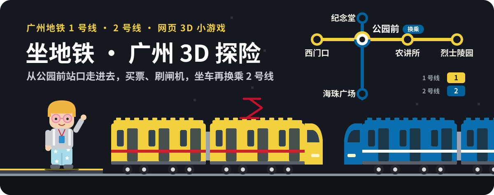
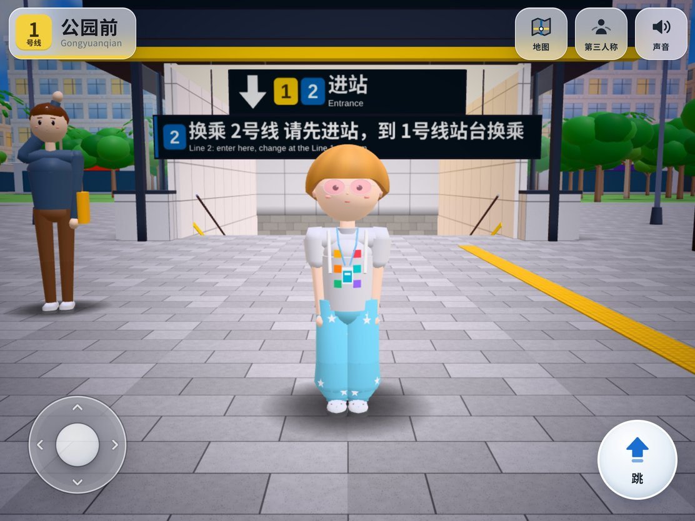
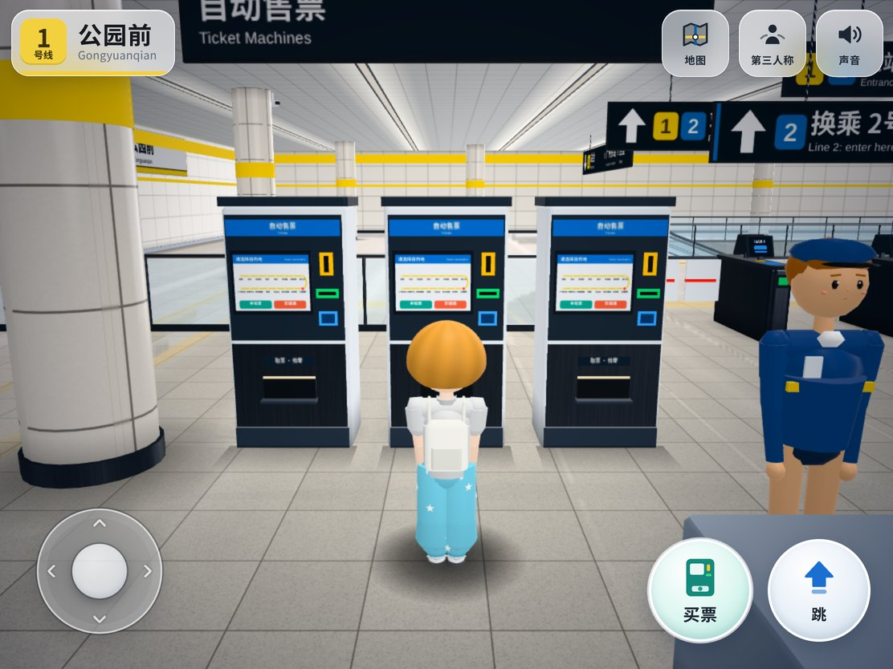
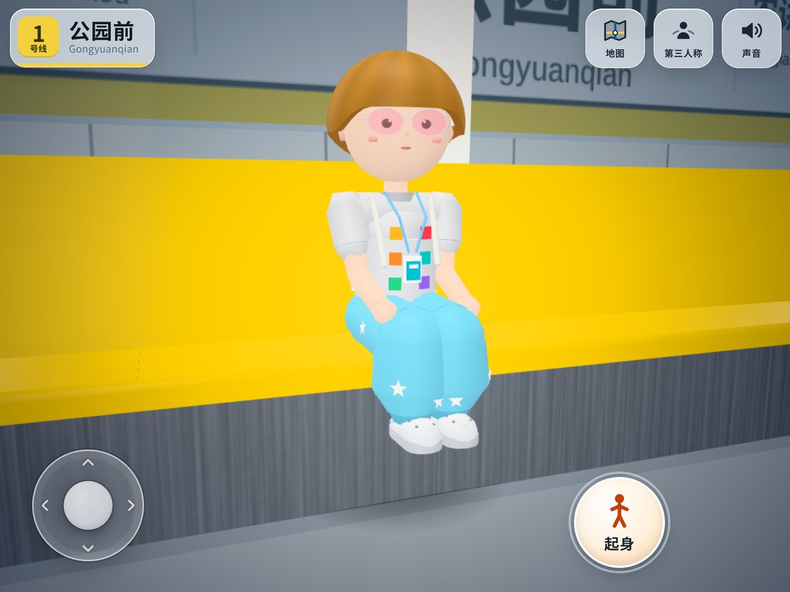
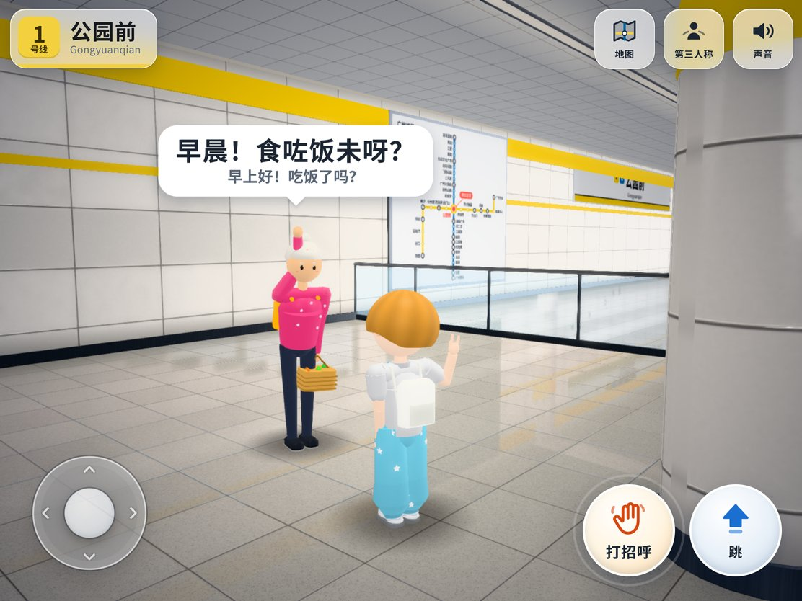
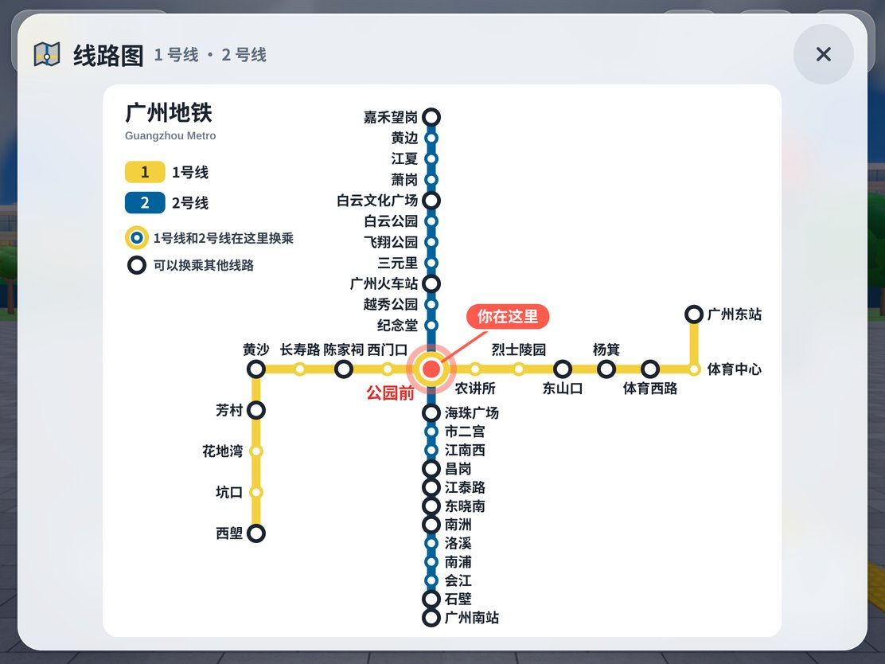
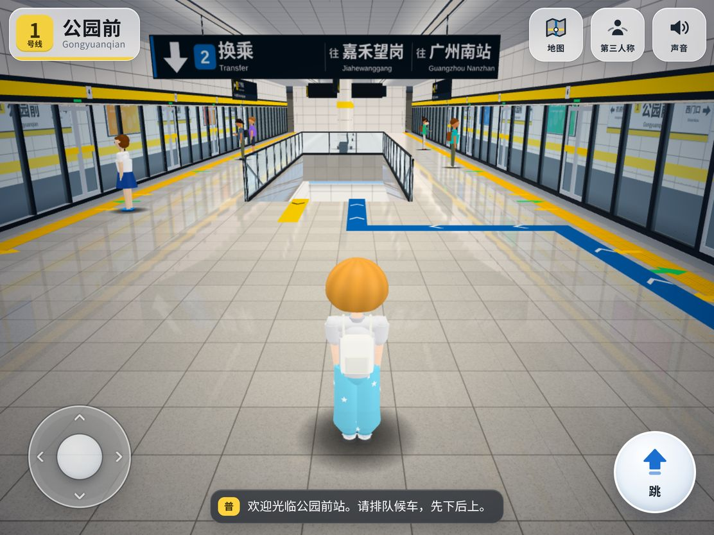

<p align="center">
  
</p>

一个给小朋友玩的网页 3D 小游戏：像《我的世界》那样，自己从广州地铁公园前站的站口走进去，买票、刷闸机、坐上 1 号线，还能在公园前换乘 2 号线。

打开就能玩，不用安装任何东西，在 iPad 上用手指操作。

**在线试玩：<https://jplay.github.io/gz-metro-explore/>**

备用地址：<https://minecraft-3d.gz-metro-bricks.pages.dev/>

<p align="center">
  
  
</p>
<p align="center">
  
  
</p>
<p align="center">
  
  
</p>

## 这个项目的由来

2026 年国庆假期我们全家去广州玩，逛了广州地铁博物馆，里面展出了 1 号线从无到有的整个建造过程。巧的是，我们住的酒店就在 1 号线的农讲所站旁边，那几天出门几乎全靠 1 号线，坐的一直是这列漂亮的黄色地铁。我们在博物馆里把它的模型买了回来，小儿子特别喜欢。

他的这份喜欢给了我灵感：让 Claude 带着 Codex 干了几个小时，就做出了一个还不错的效果。小儿子足足玩了两天。前几天刚坐过的地铁、刚买回来的车，转眼出现在他自己专属的 iPad 里，还能亲手拼、亲自坐，他觉得非常神奇。里面有很多点子是他自己提的，我都加了进去，整个过程很有意思，所以想把它分享出来。

页面算不上精良，但对一个 8 岁的孩子来说足够有趣。硬件要求也很低，我们用的是一台很老的 iPad Air 3，运行流畅。如果你家小朋友也喜欢地铁，可以直接拿去在本地跑起来。

## 能玩什么

<p align="center">
  
</p>

- 从公园前的街上走进站：过安检、在售票机上点一点想去的站，投币买一张圆圆的单程票。
- 刷闸机进站，下到站台等车，列车进站开门，进去找个座位坐下。
- 车上像真的一样报站：普通话、粤语、英语各说一遍。
- 1 号线、2 号线的车站都能坐到，想在哪站下就在哪站下。
- 在公园前跟着地上的蓝色引导带，走过换乘通道去坐 2 号线。
- 站里有阿婆、学生、上班族和游客，走过去打个招呼，他们会挥手用粤语跟你聊两句。
- 打开地图看看自己在哪儿，迷路了还可以去客服中心问路。
- 藏着几个小彩蛋，比如公园前街上那个“不可能三角”。

游戏里的小男孩是照着我家小儿子做的，打招呼和庆祝的动作都来自他的照片，里面很多点子也是他想出来的。

## 怎么玩

左半边屏幕按住拖动就能走路，右半边拖动转头看四周。
其他的事情，走到跟前都会出现一个大按钮，点一下就行。

## 在自己电脑上跑

```bash
git clone https://github.com/JPlay/gz-metro-explore.git
cd gz-metro-explore
python3 -m http.server 8080
```

然后在浏览器打开 `http://localhost:8080`。

---

代码以 [MIT](./LICENSE) 许可开源。
这是一个个人爱好项目，与广州地铁集团无关。
