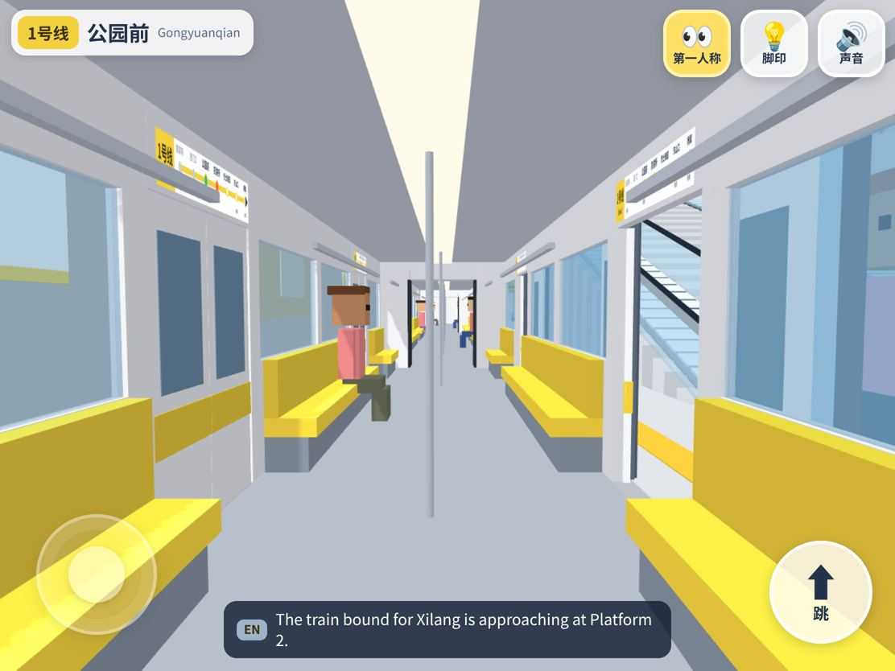
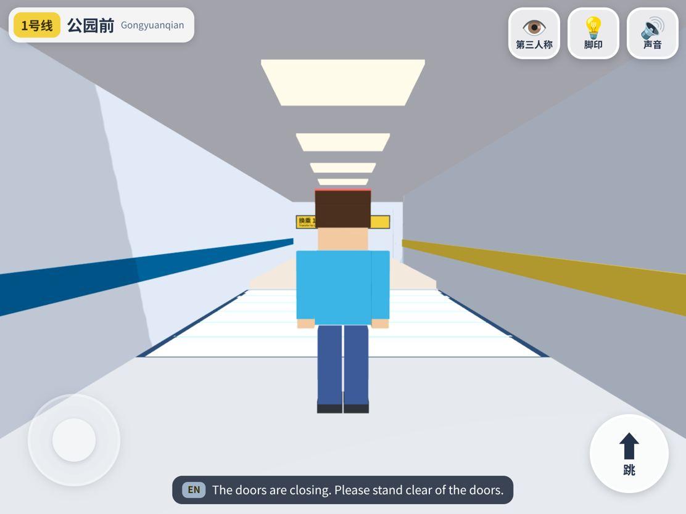

# 坐地铁 · 广州 3D 探险

一个给小朋友玩的网页 3D 游戏：像《我的世界》PE 版那样，用左手摇杆走路、右手拖动看四周，自己从广州地铁**公园前站**的站口走进去——过安检、刷闸机、下楼梯到站台、等车、上车、坐车、到站下车，还能在公园前换乘 2 号线。1 号线、2 号线一共 40 个车站都能坐到。

打开就能玩，不用安装任何东西，为 iPad（Safari，横屏）设计，竖屏也能玩。

**在线试玩：<https://jplay.github.io/gz-metro-explore/>**

> 这是公开试玩镜像，内容同步自 [JPlay/gz-metro-bricks](https://github.com/JPlay/gz-metro-bricks) 的 `minecraft-3d` 分支 @ `fef3337`。备用地址：<https://minecraft-3d.gz-metro-bricks.pages.dev/>

<p align="center">
  
  
</p>
<p align="center">
  
  
</p>

## 这个项目的由来

2026 年国庆假期我们全家去广州玩，逛了广州地铁博物馆，里面展出了 1 号线从无到有的整个建造过程。巧的是，我们住的酒店就在 1 号线的农讲所站旁边，那几天出门几乎全靠 1 号线，坐的一直是这列漂亮的黄色地铁。我们在博物馆里把它的模型买了回来，小儿子特别喜欢。

他的这份喜欢给了我灵感：让 Claude 带着 Codex 干了几个小时，就做出了一个还不错的效果。小儿子足足玩了两天。前几天刚坐过的地铁、刚买回来的车，转眼出现在他自己专属的 iPad 里，还能亲手拼、亲自坐，他觉得非常神奇。里面有很多点子是他自己提的，我都加了进去，整个过程很有意思，所以想把它分享出来。

页面算不上精良，但对一个 8 岁的孩子来说足够有趣。硬件要求也很低，我们用的是一台很老的 iPad Air 3，运行流畅。如果你家小朋友也喜欢地铁，可以直接拿去在本地跑起来。

## 怎么玩

| 操作 | iPad 触屏 | 键盘鼠标 |
| --- | --- | --- |
| 走路 / 跑 | 左半边屏幕按住拖动（摇杆出现在手指下面）；推到边就跑起来 | WASD / 方向键，按住 Shift 跑 |
| 看四周 | 右半边屏幕单指拖动 | 点一下画面锁定鼠标，移动鼠标转头（Esc 退出） |
| 拉近 / 拉远镜头 | 右半边双指捏合（第三人称） | — |
| 跳 | 右下角大“跳”按钮 | 空格 |
| 第一 / 第三人称 | 右上角“视角”按钮 | V |
| 发光脚印 | 右上角灯泡按钮（默认关） | F |
| 声音开关 | 右上角喇叭按钮 | M |

没有教程，一打开就站在公园前站口外的街上。按钮都是 84pt（跳 128pt），按下立刻变色缩小。

**一趟完整的旅程：** 街面 → 站口楼梯 → 站厅 → 安检门（嘀一声，绿灯闪，旁边 X 光机的传送带转起来）→ 闸机（走近自动打开）→ 楼梯 / 扶梯 → 岛式站台（屏蔽门）→ 列车进站、开门 → 上车 → 关门开车，进隧道，车厢里报“下一站” → 到站开门。想下就下，不下就接着坐下一站；岛式站台对面就是反方向的车，可以坐回去。到了终点站，车门会一直开着等你下车。

**换乘：** 在公园前 1 号线站台中部，跟着蓝色箭头下楼梯，走过换乘通道（中间有一座会自己拼起来的桥），再下楼梯就到 2 号线站台。

**《纪念碑谷》式小彩蛋（都不挡路）：**
- 公园前街面的“不可能三角”雕塑：站到地上发光的圆圈里看，它就会“连成一圈”并闪光。
- 换乘通道里的桥：走近时桥板一块块翻上来拼好（脚下始终有隐形地板，不会掉下去）。
- 烈士陵园站厅：一排越来越小的透视拱门，看起来比实际长很多。

## 车站与线路数据

- **1 号线**：16 站，西塱 → 广州东站，线路色 **黄色 `#F3D03E`**（核对结果：不是黄绿色）。
- **2 号线**：24 站，广州南站 → 嘉禾望岗，线路色 **蓝色 `#00629B`**。
- 换乘站只标注**已开通**的线路（例如：公园前 1↔2，体育西路 3 号线，东山口 6 号线，广州火车站 5 号线，嘉禾望岗 3/14 号线……），其他线路只出现在标识牌和报站里。
- 数据来源（2026-10-08 核对，几处互相一致）：
  1. 英文维基百科 [Line 1 (Guangzhou Metro)](https://en.wikipedia.org/wiki/Line_1_(Guangzhou_Metro))：站序、英文站名、线路色、换乘
  2. 英文维基百科 [Line 2 (Guangzhou Metro)](https://en.wikipedia.org/wiki/Line_2_(Guangzhou_Metro))：站序、英文站名、线路色、换乘
  3. 中文维基百科 [广州地铁1号线](https://zh.wikipedia.org/zh-cn/广州地铁1号线)、[广州地铁2号线](https://zh.wikipedia.org/zh-cn/广州地铁2号线)：中文站名、车站编号、代表色
  4. 百度百科“广州地铁1号线”：站名与换乘交叉核对
  5. 其他线路的颜色（只用在换乘标识上）：英文维基 Module:Adjacent stations/Guangzhou Metro
  - 广州地铁官网 gzmtr.com 在核对时从我们的网络访问超时（504），没能直接引用。
- 数据都在 [`js/data/lines.js`](./js/data/lines.js)，文件头也写了来源。

**真的能玩的 vs. 模板化的：** 40 个车站都能真的坐车到达、下车走动，但车站内部是同一套模板（换站名、主题色、换乘标识）。有专属细节的“招牌站”：公园前（人民公园树林、喷泉、不可能三角、1↔2 号线换乘通道和 2 号线站台）、农讲所（红墙黄瓦庭院、站厅红灯笼）、烈士陵园（纪念碑、木棉、透视拱门）、东山口（红砖洋楼）、越秀公园（五羊雕塑）、广州火车站（站房和大钟）。除公园前外，其他换乘站只做了一个站台，换乘线路只在标识上出现。

## 报站语音

- 优先用已经生成好的 DashScope 语音（普通话 → 粤语 → 英语，`assets/audio/voice/`）。
- 某一句没有 MP3 时，用浏览器自带的 Web Speech 朗读（与旧版逻辑相同：zh-CN；系统有粤语音色才读 zh-HK；有英语音色才读 en-US；语速 0.95），字幕照常显示。
- 缺失清单：[`tools/audio/MISSING_VOICE.md`](./tools/audio/MISSING_VOICE.md)（全网 407 条，已有 77 条，缺 330 条）。补齐方法：设置环境变量 `DASHSCOPE_API_KEY` 后运行 `python3 tools/audio/generate_voice.py`（普通话 qwen3-tts-instruct-flash Serena，粤语 qwen3-tts-flash Kiki，英语 qwen3-tts-flash Jennifer），再运行 `node tools/audio/export_jobs.mjs` 刷新清单。
- iOS 上第一次触摸屏幕时解锁音频。

## 技术架构

- **引擎**：[Babylon.js](https://www.babylonjs.com/) **9.28.0**（固定版本），UMD 版本。`js/boot.js` 按 jsDelivr → unpkg → 本仓库 `vendor/babylonjs/9.28.0/` 的顺序加载，每个来源 4 秒内没有响应就换下一个（`?bjs=vendor` 可强制用某个来源）。
- **没有构建步骤**：原生 ES 模块，直接把仓库目录部署到 Cloudflare Pages / GitHub Pages 即可。
- **画面**：明亮的低多边形方块风格；静态几何按顶点色合并，每个车站约 4 个网格（实色 / 发光 / 玻璃 / 标牌图集），标牌文字画在一张 2048² 的图集上；门扇、闸机翼、扶梯台阶、脚印用实例化；阴影只投射玩家和列车。
- **性能（A12）**：4 档画质（渲染倍率 1.5 / 1.25 / 1.0 / 0.8，前两档有阴影），帧率低于 45 自动降档，`?q=0..3` 可固定档位；分辨率最高只用 1.5 倍。
- **移动与碰撞**：Babylon 内置椭球碰撞（`moveWithCollisions`），自己算重力和跳跃；碰撞体是不可见方块，坡道是旋转的薄板。第三人称镜头用射线检测避免穿墙。
- **坐车**：列车开进隧道深处后，整列车连同玩家一起平移到一段“行驶隧道”（灯光往后流动），这时重建下一站，再从下一站的隧道口减速进站。所以 40 个车站共用一套模板，但每一站都能真的停靠。

```text
index.html             页面骨架（画布、触摸层、HUD、字幕、加载条）
css/app.css            触屏 UI
js/boot.js             Babylon CDN 加载链（jsDelivr → unpkg → vendor）
js/main.js             入口：引擎、灯光阴影、画质、主循环、测试接口 window.__game
js/core/               配置、几何合并工具、共享材质
js/data/lines.js       1/2 号线车站数据（含来源）
js/data/phrases.js     报站文案与语音片段 id
js/world/              车站模板、列车、装饰、纪念碑谷彩蛋
js/game/               玩家、输入（摇杆/拖动/捏合/键鼠）、列车运营、发光脚印
js/audio/              音频引擎、报站、Web Speech 兜底
js/ui/                 HUD、字幕
assets/audio/          报站语音、环境声、音效（来源见 CREDITS.md）
tools/audio/           语音生成脚本与缺失清单
vendor/babylonjs/      Babylon.js 本地备份（Apache-2.0）
```

## 本地运行

```bash
git clone https://github.com/JPlay/gz-metro-bricks.git
cd gz-metro-bricks
git checkout minecraft-3d
python3 -m http.server 8080
```

然后在浏览器打开 `http://localhost:8080`。测试用参数：`?start=lsly&line=1` 直接从某站站台开始，`?q=2` 固定画质，`?bjs=vendor` 只用本地引擎。

## 已知的不足

- 自动化测试只在桌面无头 Chromium（软件渲染）里跑过，没有在真 iPad Air 3 上验证帧率和手感。
- 车站内部是模板，不是真实布局；公园前以外的换乘站只建了一个站台。
- 330 条报站语音还没有 MP3，用浏览器朗读代替（音色因设备而异，部分设备没有粤语音色就会跳过粤语）。
- 车里的乘客和站里的人是静止的。
- 列车运行间隔、开关门时间都做了缩短，不是真实时刻。

## 许可与声明

- 代码以 [MIT](./LICENSE) 许可开源。`vendor/babylonjs/` 是 Babylon.js，Apache-2.0 许可。
- 音频素材的来源和许可见 [`assets/audio/CREDITS.md`](./assets/audio/CREDITS.md)。
- 这是一个个人爱好项目，与广州地铁集团无关联；站名、线路等信息仅用于还原乘车场景。
